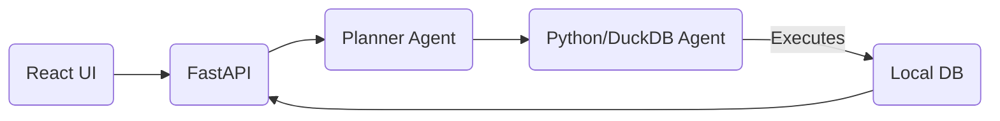

# Deep Stat AI: Agentic NBA Analyst

An autonomous "Data Scientist" agent that answers complex natural language queries about NBA history by writing and executing code (Pandas/DuckDB) against local datasets.

**Goal**: Transform *"Who had the most triple-doubles in 2016?"* into precise analytics and visualizations.

## 🚀 Architecture: "The Code Factory"
Unlike LLMs that hallucinate stats, Deep Stat uses **Program Synthesis**:

### Tech Stack
*   **Frontend**: React (Vite)
*   **Backend**: FastAPI
*   **Logic**: LangChain + Ollama (Llama 3.2 for Coding, Mistral for Planning)
*   **Database**: DuckDB (Relational Stats) + ChromaDB (Vector Search)

## ⚡ Quick Start

### Prerequisites
*   **Python 3.10+** (Python 3.14 recommended to avoid? No, 3.10 is stable).
*   **Node.js 18+**
*   **Ollama** running (`ollama serve`).

### 1. One-Click Setup
Double-click `setup_env.bat`.
*   Creates Python environment.
*   Installs dependencies.
*   **Crucial Step**: Initializes `nba.duckdb` from your raw CSVs (~1 minute).

### 2. Launch
Double-click `start_app.bat`.
*   Starts Backend at `http://localhost:8000`.
*   Starts Frontend at `http://localhost:5173`.

## 📂 Project Structure
*   `/agents`: The brain (Architect, Coder).
*   `/utils`: Data pipelines (`init_db.py`).
*   `/client`: React Frontend.
*   `api.py`: FastAPI entry point.
*   `nba.duckdb`: High-performance local database (Generated).

## 🧠 How it works
1.  **User**: *"How did Lebron play in the 2012 Finals?"*
2.  **Architect**: Deconstructs into: `Filter(Player='Lebron James')`, `Filter(Season=2011)`, `Filter(Round=Finals)`, `Agg(Avg PTS, REB, AST)`.
3.  **Coder**: Writes a Python script using `duckdb.query("SELECT ...")`.
4.  **Executor**: Runs the script safely and returns the result.