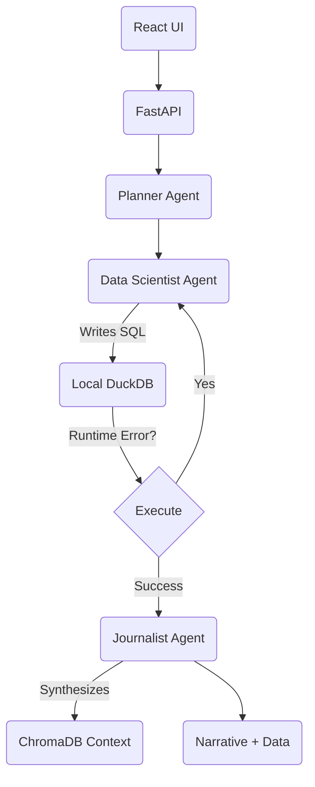

# Deep Stat AI: Agentic NBA Analyst

An autonomous "Data Scientist" agent that answers complex natural language queries about NBA history by writing and executing SQL/Python code against local datasets, then synthesizing the results into a sports journalism narrative.

**Goal**: Transform complex queries like *"Compare LeBron and Curry as GOAT candidates"* into precise statistical tables (PPG, Wins, Efficiency) accompanied by a fact-checked narrative.

## 🚀 Architecture: "Four-Stage Pipeline"

Unlike basic RAG or Text-to-SQL, Deep Stat AI uses a self-correcting agent chain:



### Agents
1.  **Architect** (`agents/architect.py`): Translates vague questions into a logical execution plan. Handles strict NBA business logic (e.g., "Season 2015" = "2016 Finals").
2.  **Coder** (`agents/coder.py`): A specialized SQL expert. Writes pure DuckDB SQL for filtering/aggregation to avoid Pandas ambiguity errors. Equipped with schema knowledge including `teams` and `game_stats`.
3.  **Analyst** (`agents/analyst.py`): A "Sports Journalist" persona. Takes the dry data row and RAG context (Wiki/Bio) to write a compelling 1-paragraph story. Strictly forbids table outputs.

### Tech Stack
*   **LLM**: `qwen2.5-coder:7b-instruct` (Running locally via Ollama).
*   **Backend**: FastAPI to orchestrate the agent chain.
*   **Database**: DuckDB (Structured Stats) + ChromaDB (Vector Embeddings/RAG).
*   **Frontend**: React + Vite.

## ⚡ Quick Start

### Prerequisites
*   **Python 3.10+**
*   **Node.js 18+**
*   **Ollama**: Installed and running (`ollama serve`).
*   **Model**: You MUST pull the specific model:
    ```bash
    ollama pull qwen2.5-coder:7b-instruct
    ```

### 1. One-Click Setup
Double-click `setup_env.bat` (Windows).
*   Creates Python virtual environment (`venv`).
*   Installs dependencies (`requirements.txt`).
*   **Crucial Step**: Initializes `nba.duckdb` and `nba_chroma` from raw CSVs.

### 2. Launch Application
Double-click `start_app.bat`.
*   Starts Backend at `http://localhost:8000`.
*   Starts Frontend at `http://localhost:5173`.

## 🔍 Supported Query Types
*   **Simple Stats**: *"Who had the most points in 2016?"*
*   **Championships**: *"Who won the 2016 Finals?"* (Handles Season/Year logic).
*   **Comparisons (Advanced)**: *"Compare LeBron and Curry as GOAT candidates"* (Generates Multi-Player Stats Table).
*   **Narrative Deep Dives**: *"Tell me about the 2016 Cavaliers comeback."*

## 🧠 Methodology: "SQL-First"

We pivoted from generating Pandas code to **DuckDB SQL**.
*   **Why?** Pandas code generation often leads to `AmbiguityError` or subtle index bugs.
*   **Solution**: The Coder agent is strictly instructed to perform all heavy lifting (Joins, Filters, Aggregations, Championship Logic) inside `con.execute("SELECT ...")`. Python is used only for display.

## 🛠️ Troubleshooting

**"Model Not Found"**
*   Ensure you ran `ollama pull qwen2.5-coder:7b-instruct`. The code is hardcoded to this tag for stability.

**"Analyst Returned No Narrative"**
*   This means the LLM returned an empty string. The UI will show a fallback error. Check the terminal logs for `[Analyst] Output Length: 0`.

**"Binder Error / Column Not Found"**
*   The API has a **Self-Correction Loop**. It will automatically feed the error back to the Coder agent to try again (up to 2 retries). If it still fails, check `schema_dump.txt` vs `agents/coder.py`.